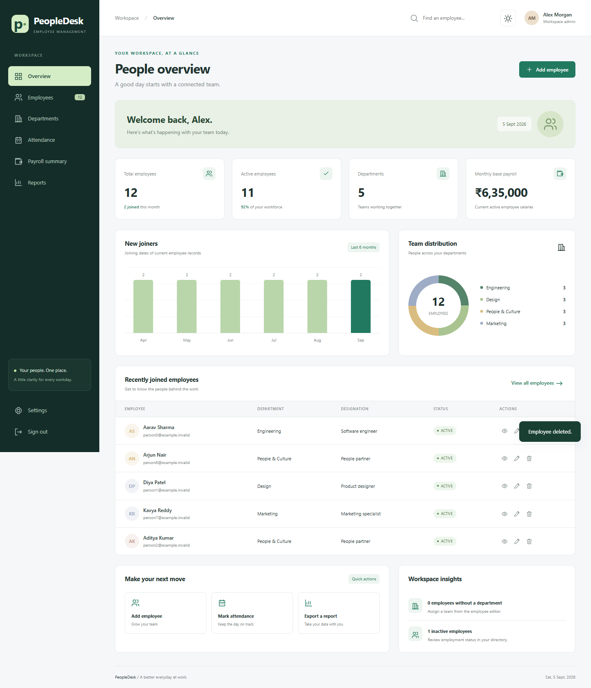

# PeopleDesk admin dashboard

A responsive employee-management workspace built into the existing Spring Boot application.

## Start the application

- In Eclipse, refresh the project and run `EmployeeManagementSystemApplication.java` as a Java/Spring Boot application.
- Or double-click `run-dashboard.cmd` in this directory.
- Open **http://localhost:8082/** and sign in with an existing **ADMIN** account from your database. If `PORT` is set, use that port instead.
- The dashboard is served by Spring Boot; do not open the HTML file directly from disk.

Java 21 and the configured PostgreSQL connection are required. The launch script can use the Java 21 runtime bundled with Eclipse if JAVA_HOME is not configured. The existing database configuration remains in `src/main/resources/application.properties`.

The existing Hibernate `ddl-auto=update` setting creates department and attendance tables and adds the nullable employee department assignment when the application starts. Existing employees initially appear as Unassigned.

## Working modules

- **Overview:** live employee counts, department distribution, six-month new-joiner chart, current salary totals, recent joiners, and quick actions.
- **Employees:** add, view, edit, delete, active/inactive status, department assignment, search, filters, sorting, pagination, and filtered CSV download.
- **Departments:** create/edit teams, manager and description, team headcount, employee drill-down, and deletion protection for assigned teams.
- **Attendance:** dated present/absent/leave/remote records, mark-all-present, transactional save, reload persistence, unsaved-change handling, and daily CSV export. Future dates are rejected.
- **Payroll summary:** current monthly base salary, annual projection, active-employee totals, salary editing, and CSV download. This is a planning summary, not payment processing or a statutory payroll calculation.
- **Reports:** employee directory, department summary, base salary reports, daily attendance export, and printable overview.
- **Settings:** browser-local display name, workspace label, and persistent light/dark appearance.
- **Access:** server-side admin session checks, session invalidation on sign-out, and no-store responses for protected routes. Existing account/password records are preserved.

There are no fabricated employee statistics or seeded accounts in normal application startup. Screenshot sample data exists only in the isolated test database.

## Checks

```powershell
# Java 21 / JAVA_HOME required
.\mvnw.cmd test

# Run API and Chrome interaction tests together
npm ci
.\mvnw.cmd "-DuiTest=true" test

# Build the runnable JAR
.\mvnw.cmd package
```

Browser checks require Node.js and installed Google Chrome. Tests use an in-memory H2 database and never connect to the configured PostgreSQL database. They cover admin/employee access, invalid and duplicate records, department deletion protection, attendance updates and rollback, logout, employee CRUD, filtering/pagination, CSV contents, theme persistence, error recovery, and mobile overflow.

Browser checks regenerate the preview images below. `npm run format` formats the dashboard frontend and browser test.

## Previews

[Desktop](docs/dashboard-desktop.png) · [Mobile](docs/dashboard-mobile.png) · [Dark theme](docs/dashboard-dark.png)


